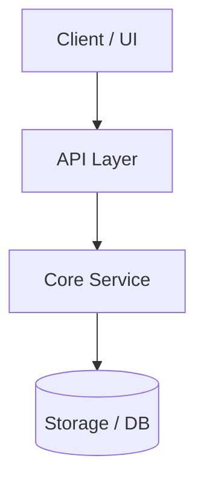

# Technical Design: <Title>

**Change ID**: `<change-id>`  
**Based on SSOT**: [`explore.md`](file:///openspec/changes/<change-id>/explore.md)

---

## 1. System Architecture Overview



---

## 2. Component Design & Interfaces

### 2.1 Component / Module A
- **Role**: <Responsibilities>
- **Interface / API**:
```typescript
interface ExampleInterface {
  id: string;
  execute(): Promise<void>;
}
```

---

## 3. Data Models & Schemas
<Description of database tables, JSON schemas, or state models.>

---

## 4. Security, Performance & Scalability
- **Security Considerations**: <Details>
- **Performance Targets**: <Details>
