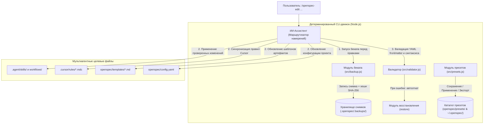

# Технический дизайн (Technical Design): Кастомизация команд, система пресетов и детерминированный бекап/откат

**Идентификатор изменения (Change ID)**: `custom-command-editor`  
**Задача в GitHub**: [OEX-1](https://github.com/h0tnanny/openspec-ex/issues/1)  
**Основано на SSOT**: [`explore.md`](file:///d:/Documents/Projects/openspec-ex/openspec/changes/custom-command-editor/explore.md)

---

## 1. Архитектурная схема системы

Архитектура строго разграничивает обязанности между **Детерминированным CLI-движком** (написанным на чистом Node.js) и **Интеллектуальным маршрутизатором намерений ИИ** (в составе воркфлоу `/openspec-edit`).



---

## 2. Дизайн компонентов и программные интерфейсы

### 2.1 Менеджер бекапа и восстановления (`src/backup.js`)

- **Обязанности**:
  - Создание атомарных снимков с фиксацией времени и контрольных сумм SHA-256.
  - Ведение реестра снимков (`.openspec/.backups/manifests.json`).
  - Безопасное восстановление файлов без использования ИИ.
  - Извлечение эталонной базовой конфигурации из установленного пакета для фабричного сброса.

```typescript
interface BackupManifestItem {
  id: string; // Уникальный идентификатор снимка (например snapshot-20260828-1420)
  timestamp: string; // Время создания в формате ISO
  reason: string; // Причина бекапа (например: "pre-edit: add security checklist")
  agent: string; // Имя активного ассистента
  files: Array<{
    relativePath: string;
    sha256: string;
    sizeBytes: number;
  }>;
}

interface BackupManager {
  // Создание снимка перед операцией
  createSnapshot(options: { reason: string; tag?: string }): Promise<string>;
  // Получение списка всех сохраненных снимков
  listSnapshots(): Promise<BackupManifestItem[]>;
  // Получение разницы между снимком и текущим состоянием
  diffSnapshot(snapshotId: string): Promise<string>;
  // Откат к снимку или заводским настройкам
  restoreSnapshot(options: { snapshotId?: string; latest?: boolean; factoryReset?: boolean }): Promise<void>;
}
```

### 2.2 Менеджер пресетов (`src/presets.js`)

- **Обязанности**:
  - Упаковка текущих скиллов, шаблонов, правил и конфигурации в именованный пресет.
  - Поддержка локального (`openspec/presets/<имя>/`) и глобального (`~/.openspec/presets/<имя>/`) хранилищ.
  - Экспорт и импорт пресетов в формате JSON для обмена внутри команды.
  - Интеграция с командой инициализации `npx openspec-ex init --preset <имя>`.

```typescript
interface PresetBundle {
  name: string;
  version: string;
  description: string;
  createdAt: string;
  skills: Record<string, string>; // имя_скилла -> содержимое SKILL.md
  workflows: Record<string, string>; // имя_воркфлоу -> содержимое Markdown
  templates: Record<string, string>; // имя_шаблона -> содержимое Markdown
  rules: Record<string, string>; // имя_правила -> содержимое Markdown
  configYaml?: string; // openspec/config.yaml
}

interface PresetsManager {
  savePreset(name: string, options: { global?: boolean; desc?: string }): Promise<string>;
  applyPreset(name: string): Promise<void>;
  listPresets(): Promise<Array<{ name: string; type: 'project' | 'global' | 'factory'; description: string }>>;
  exportPreset(name: string, outputFile: string): Promise<void>;
  importPreset(inputFile: string): Promise<string>;
}
```

### 2.3 Воркфлоу кастомизатора команд (`workflows/opsx-edit.md` & `skills/openspec-edit/SKILL.md`)

- **Обязанности**:
  - Автономный семантический разбор запроса на естественном языке.
  - Сопоставление целевых файлов по мультиагентному дереву.
  - Оценка уровня риска (Критический 🔴 / Предупреждение 🟡 / Информационный 🟢).
  - Запуск скриптового бекапа перед редактированием и валидация результата после записи.

---

## 3. Архитектура тестирования и CI/CD Gate


Для сохранения принципа **Zero Dependencies** тестовый набор реализуется на базе стандартных модулей Node.js: `assert` и `child_process`.

```
test/
├── run-all-tests.js       <-- Главный раннер, собирающий все результаты
├── backup.test.js         <-- Снимки, SHA-256 хеши, restore --latest, --id, --factory-reset
├── presets.test.js        <-- Сохранение, применение, экспорт/импорт JSON, валидация бандла
└── cli.test.js            <-- Тестирование CLI вызовов, парсинг аргументов, коды возврата
```

GitHub Actions workflow (`.github/workflows/ci.yml`) блокирует сборку и публикацию пакета при падении любого из тестов.

---

## 4. Файловая структура хранилища

```text
.openspec/
├── config.yaml
├── templates/
│   ├── explore.md
│   ├── proposal.md
│   ├── design.md
│   └── tasks.md
├── presets/
│   └── fintech-strict/
│       ├── meta.json
│       ├── skills/
│       └── templates/
└── .backups/
    ├── manifests.json
    └── 2026-08-28_01-45-00_snap-1/
        ├── meta.json
        ├── .agent/skills/
        ├── .agent/workflows/
        ├── .cursor/rules/
        └── openspec/templates/
```

---

## 5. Безопасность, отказоустойчивость и протокол отката

1. **Детерминированность**: все операции создания снимков, подсчета контрольных сумм и восстановления выполняются напрямую библиотеками Node.js (`fs`, `crypto`, `path`), что на 100% исключает риск галлюцинаций ИИ.
2. **Транзакционность правок**: если валидатор обнаруживает повреждение YAML-заголовков или синтаксиса, CLI немедленно производит откат к снимку, созданному перед редактированием.
3. **Гарантированный фабричный сброс**: каталог пакета (`path.resolve(__dirname, '..')`) служит постоянным неизменяемым источником эталонных файлов для опции `--factory-reset`.
