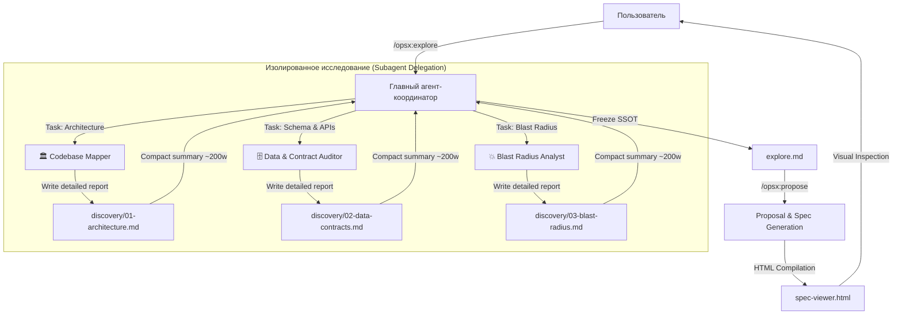

# Technical Design: Subagent Exploration Architecture & Discovery Insights

**Change ID**: `subagent-discovery-protocol`  
**Based on SSOT**: [`explore.md`](file:///openspec/changes/subagent-discovery-protocol/explore.md)

---

## 1. System Architecture Overview



---

## 2. Component Design & Interfaces

### 2.1 Subagent Exploration Protocol (`skills/openspec-explore/SKILL.md`)
- **Триггер**: Анализ кодовой базы, затрагивающий более 3 несвязанных модулей или требующий глубокого парсинга схем.
- **Интерфейс делегирования**:
  1. Вызов сабагента с фиксированным контекстом задачи.
  2. Путь назначения отчёта: `openspec/changes/<change-name>/discovery/<index>-<name>.md`.
  3. Формат ответа координатору: краткий Markdown-бриф (до 200–300 слов) с ключевыми интерфейсами, рисками и точками интеграции.

### 2.2 Anti-Execution Guardrail (`rules/openspec.md`)
- **Правило изоляции фаз**:
  - В режиме Explore агент не генерирует системные артефакты `implementation_plan.md` и блокирует запуск редактирования исходного кода.
  - Любые правки кода допускаются только после вызова `/opsx:apply` и проверки разрешения всех замечаний из `spec-viewer.html`.

### 2.3 Spec Viewer Architecture (`src/generator.js`)
- **Discovery Tab Scanner**:
  ```javascript
  const discoveryDir = path.join(resolvedDir, 'discovery');
  // Динамическое считывание discovery/*.md и рендеринг в spec-viewer.html
  ```
- **Mermaid.js Integration**:
  - Client-side подключение `mermaid.min.js`.
  - Инициализация `dark` темы с CSS-переменными shadcn/ui.
  - Рендеринг блоков ` ```mermaid ` внутри интерактивных карточек со стилизацией и кнопками замечаний.
- **Task Tracker**:
  - Автоматический подсчёт `-\s+\[([ xX])\]` в `tasks.md`.
  - Отображение полосы прогресса в шапке вьюера.
- **Feedback Downloader**:
  - Генерация Markdown-файла `feedback.md` через `Blob` API и скачивание в один клик.

---

## 3. Data Models & Schemas

### Структура директории `openspec/changes/<change-id>/`
```
openspec/changes/<change-id>/
├── explore.md                # Frozen SSOT
├── proposal.md               # Change proposal & scope
├── design.md                 # Technical architecture & Mermaid schemas
├── tasks.md                  # Traceability matrix & checklists
├── spec-viewer.html          # Standalone interactive UI
└── discovery/                # Детальные брифы сабагентов
    ├── 01-architecture.md
    ├── 02-data-contracts.md
    └── 03-blast-radius.md
```

---

## 4. Security, Performance & Scalability

- **Экономия токенов**: Снижение потребления контекстного окна координатора в 5–10 раз при анализе объемных кодовых баз.
- **Zero-Dependency Bundle**: Сгенерированный `spec-viewer.html` полностью автономен, работает оффлайн и через локальный `file://` протокол.
- **Кросс-платформенность**: Поддержка Windows, macOS, Linux без дополнительных бинарных зависимостей.
