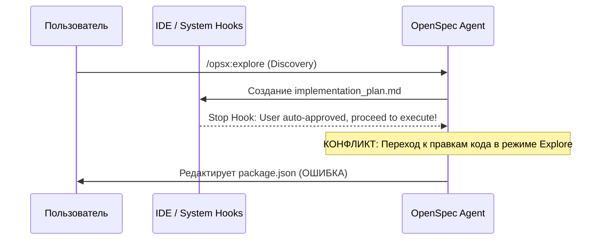

# Discovery Brief: Explore Stance Isolation & Anti-Execution Guardrails

**Author**: Safety & Stance Auditor Subagent  
**Date**: 2026-08-28  
**Status**: Completed  

---

## 1. Analysis of the Conflict Mechanism

---

## 2. Guardrail Specifications

1. **Suppression of Generic Planning Artifacts**: In Explore mode, never emit generic `implementation_plan.md` files that trigger the IDE's auto-execution hook. All thinking must be frozen exclusively in `explore.md`.
2. **Phase Boundary Assertion**: The OpenSpec agent must strictly enforce that code modifications require the `/opsx:apply` slash command.
