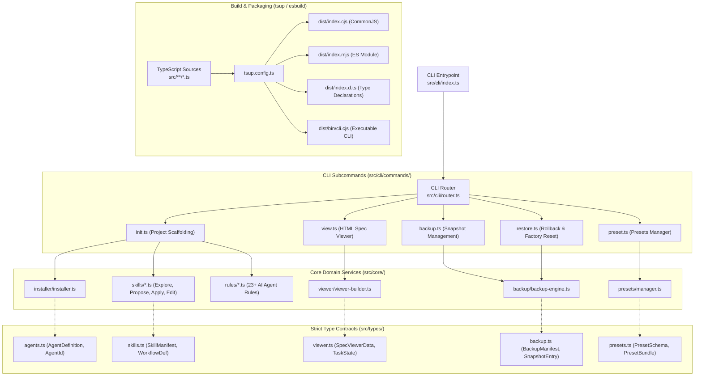

# Технический дизайн (Technical Design): Полная миграция OpenSpec-Ex на TypeScript

**Идентификатор изменения (Change ID)**: `typescript-migration`  
**Задача в GitHub**: [OEX-3](https://github.com/h0tnanny/openspec-ex/issues/3)  
**Основано на SSOT**: [`explore.md`](file:///d:/Documents/Projects/openspec-ex/openspec/changes/typescript-migration/explore.md)

---

## 1. Архитектурная схема системы

### ASCII-диаграмма компонентов:
```text
+-------------------------------------------------------------------------------+
|                            CLI ROUTER (src/cli/)                              |
|                          Entry: src/cli/index.ts                              |
+-------------------------------------------------------------------------------+
       |                   |                   |                 |
       v                   v                   v                 v
  [init.ts]           [view.ts]          [backup.ts]        [preset.ts]
       |                   |                   |                 |
       +-------------------+-------------------+-----------------+
                                   |
                                   v
+-------------------------------------------------------------------------------+
|                       CORE DOMAIN SERVICES (src/core/)                        |
|                                                                               |
|  [installer/]     [skills/]       [rules/]        [viewer/]    [backup/]      |
|  Installer &      6 Typed Skill   23+ Agent Rule  Spec Viewer  SHA-256 Engine |
|  Scaffolding      Generators      Generators      & Mermaid    & Restore      |
+-------------------------------------------------------------------------------+
                                   |
                        (Strict Type Contracts)
                                   v
+-------------------------------------------------------------------------------+
|                         TYPE DEFINITIONS (src/types/)                         |
|                                                                               |
|   AgentDefinition  •  BackupManifest  •  PresetSchema  •  SpecViewerData      |
+-------------------------------------------------------------------------------+
                                   |
                        (tsup Build Pipeline)
                                   v
+-------------------------------------------------------------------------------+
|                         DISTRIBUTABLE PACKAGE (dist/)                         |
|                                                                               |
|   dist/index.cjs (CJS)  •  dist/index.mjs (ESM)  •  dist/index.d.ts (Types)   |
|   dist/bin/cli.cjs (Executable CLI with shebang #!/usr/bin/env node)          |
+-------------------------------------------------------------------------------+
```

### Mermaid-диаграмма:


---

## 2. Дизайн типов и контрактов (`src/types/`)

### 2.1 Идентификаторы и метаданные агентов (`src/types/agents.ts`)

```typescript
export type AgentId =
  | 'antigravity'
  | 'cursor'
  | 'claude'
  | 'windsurf'
  | 'copilot'
  | 'cline'
  | 'opencode'
  | 'codex'
  | 'amazonq'
  | 'universal';

export interface AgentRuleConfig {
  skillsDir?: string;
  workflowsDir?: string;
  rulesDir?: string;
  ruleFileName?: string;
  ruleFormat: 'markdown' | 'mdc' | 'yaml' | 'custom';
  supportsWorkflows: boolean;
  supportsSubagents: boolean;
}

export interface AgentDefinition extends AgentRuleConfig {
  id: AgentId;
  name: string;
  description: string;
}
```

### 2.2 Детерминированный бекап и снимки (`src/types/backup.ts`)

```typescript
export interface SnapshotFileEntry {
  relativePath: string;
  sha256: string;
  sizeBytes: number;
}

export interface BackupManifest {
  id: string;
  timestamp: string;
  reason?: string;
  targetAgents: AgentId[];
  files: SnapshotFileEntry[];
  totalFiles: number;
  totalBytes: number;
}

export interface BackupListResult {
  snapshots: BackupManifest[];
  totalCount: number;
}
```

### 2.3 Схемы пресетов (`src/types/presets.ts`)

```typescript
export interface PresetSchema {
  version: '1.0.0';
  name: string;
  description: string;
  author?: string;
  createdAt: string;
  targetAgents: AgentId[];
  skills: Record<string, string>;
  rules: Record<string, string>;
  workflows: Record<string, string>;
  templates: Record<string, string>;
}

export interface PresetBundle {
  schemaVersion: '1.0.0';
  preset: PresetSchema;
  checksum: string;
}
```

---

## 3. Декомпозиция монолита `generator.js` (77 KB)

### 3.1 Модули генерации скиллов (`src/core/skills/`)
Каждый скилл изолируется в свой модуль, возвращающий типизированный Markdown с YAML-заголовками:
- `explore-skill.ts`: генератор `openspec-explore` (SSOT, интервью Grill-Me, субагенты, анти-экзекьюшн).
- `propose-skill.ts`: генератор `openspec-propose` (строгая опора на `explore.md`, самоаудит, компиляция `spec-viewer.html`).
- `apply-skill.ts`: генератор `openspec-apply-change` (верификация обратной связи, пошаговое выполнение).
- `archive-skill.ts`: генератор `openspec-archive-change` (безопасная архивация и коммит).
- `sync-skill.ts`: генератор `openspec-sync-specs` (слияние дельта-спеков).
- `edit-skill.ts`: генератор `openspec-edit` (маршрутизация намерений, бекапы, пресеты).

### 3.2 Модули правил для AI-агентов (`src/core/rules/`)
- `antigravity.ts`: правила `.agent/rules/project-workflow.md` и воркфлоу `.agent/workflows/*.md`.
- `cursor.ts`: генератор `.cursorrules` и `.cursor/rules/*.mdc` с YAML frontmatter.
- `claude.ts`: генератор `CLAUDE.md` и `.claude/skills/`.
- `windsurf.ts`: генератор `.windsurfrules` и `.windsurf/skills/`.
- `copilot.ts`: генератор `.github/copilot-instructions.md`.
- `cline.ts`: генератор `.clinerules` и `.cline/`.
- `universal.ts`: универсальный генератор для всех остальных агентов.

### 3.3 Интерактивный HTML Spec Viewer (`src/core/viewer/`)
- `viewer-builder.ts`: читает структуру `openspec/changes/<name>`, формирует JSON-модель `SpecViewerData`.
- `mermaid-renderer.ts`: сериализует граф состояний задач и зависимостей в Mermaid.js синтаксис.
- `dom-template.ts`: типизированный HTML/CSS/JS шаблон со встроенным темным/светлым оформлением, поддержкой фильтрации и рецензирования.

---

## 4. Конфигурация сборщика (`tsup.config.ts`) и `package.json`

```typescript
import { defineConfig } from 'tsup';

export default defineConfig({
  entry: {
    index: 'src/index.ts',
    'bin/cli': 'src/cli/index.ts',
  },
  format: ['cjs', 'esm'],
  dts: true,
  clean: true,
  sourcemap: true,
  shims: true,
  target: 'node16',
  outDir: 'dist',
  banner: ({ entry }) => {
    if (entry.includes('cli')) {
      return { js: '#!/usr/bin/env node' };
    }
    return {};
  },
});
```

---

## 5. Стратегия тестирования и верификации

1. **Unit-тесты (`test/unit/`)**:
   - `backup.test.ts`: проверка вычисления хешей SHA-256, создание снимков, откат и фабричный сброс.
   - `presets.test.ts`: проверка сохранения, чтения, экспорта и импорта бандлов.
   - `agents.test.ts`: проверка резолвинга путей для всех 23+ агентов.
2. **Golden Master Snapshot Tests (`test/snapshots/`)**:
   - Сравнение сгенерированных скиллов и правил для всех агентов с эталонами с помощью `expect(output).toMatchSnapshot()`.
3. **CLI Integration Tests (`test/integration/`)**:
   - Проверка выполнения бинарника через `child_process.execFile` во временных каталогах.
