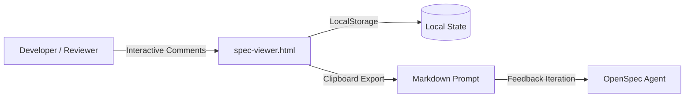

# Technical Design: OpenSpec Feedback Loop

**Change ID**: `user-feedback-loop`  
**Based on SSOT**: [`explore.md`](file:///openspec/changes/user-feedback-loop/explore.md)

---

## 1. System Architecture Overview



---

## 2. Component Design & Interfaces

### 2.1 Viewer Generator (`generate-viewer.js`)
- **Input**: Directory containing `explore.md`, `proposal.md`, `design.md`, `tasks.md`.
- **Output**: Single bundled `spec-viewer.html` without external JS/CSS dependencies.

### 2.2 Comment Data Schema
```typescript
interface OpenSpecComment {
  id: string;
  blockId: string;
  refText?: string;
  text: string;
  status: 'open' | 'resolved';
  timestamp: string;
}
```
